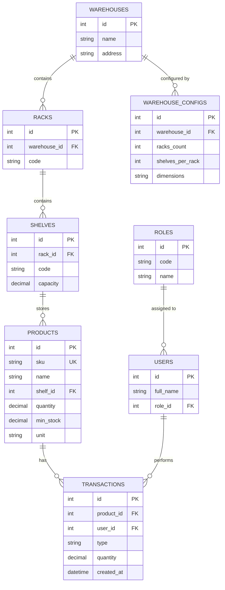

# Модель данных (ERD)

Модель спроектирована на основе процессов и требований. Иерархия склада детализирована до ячейки — это необходимо для визуализации и поиска товара.

```mermaid
erDiagram
    WAREHOUSES ||--o{ RACKS : contains
    RACKS ||--o{ SHELVES : contains
    SHELVES ||--o{ PRODUCTS : stores
    PRODUCTS ||--o{ TRANSACTIONS : has
    USERS ||--o{ TRANSACTIONS : performs
    ROLES ||--o{ USERS : "assigned to"
    WAREHOUSES ||--o{ WAREHOUSE_CONFIGS : "configured by"

    WAREHOUSES {
        int id PK
        string name
        string address
    }
    WAREHOUSE_CONFIGS {
        int id PK
        int warehouse_id FK
        int racks_count
        int shelves_per_rack
        string dimensions
    }
    RACKS {
        int id PK
        int warehouse_id FK
        string code
    }
    SHELVES {
        int id PK
        int rack_id FK
        string code
        decimal capacity
    }
    PRODUCTS {
        int id PK
        string sku UK
        string name
        int shelf_id FK
        decimal quantity
        decimal min_stock
        string unit
    }
    TRANSACTIONS {
        int id PK
        int product_id FK
        int user_id FK
        string type
        decimal quantity
        datetime created_at
    }
    USERS {
        int id PK
        string full_name
        int role_id FK
    }
    ROLES {
        int id PK
        string code
        string name
    }
```
